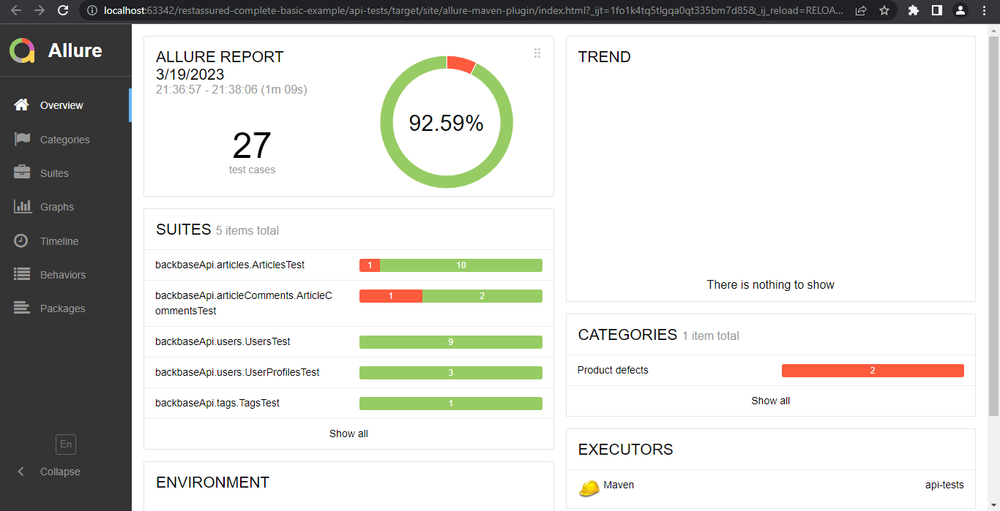

## External dependencies

For this project to run, you would need to install below 3 dependencies on your machine:

- **[Java 17](https://openjdk.java.net/projects/jdk/11/)** (as the core programming language)
- **[Maven 3.10.1](https://maven.apache.org/download.cgi)** (for dependency management)
- **[RestAssured](http://rest-assured.io/)** (for api automation)
- **[JUnit 5](https://junit.org/junit5/)** (for assertions and test creation)
- **[java-faker](https://github.com/DiUS/java-faker)** (for generating fake data)
- **[Allure Report](https://docs.qameta.io/allure/)** (for reporting)

## Getting Started
For easiest way to getting started, extract this project and open it from IntelliJ.
> Then Do a dry run on test in : test -> java -> backbaseApi package -> any test class and see if your setup is correct.

## Languages and Framework
1. Java 17 as the programming language
2. Junit as the UnitTest framework to support the test creation
3. RestAssured to hit and automate the APIs
4. Allure Report as the testing report strategy 
5. DataFaker as the faker data generation strategy
6. Log4J2 as the logging management strategy 
7. Properties file to handle and manage the components

## Scenarios Covered
1. Create a new user using "/api/users" API
2. Create a new user with empty API using "/api/users" API
3. Error creating a new user when email and username is empty
4. Error creating a new user which already exists
5. Error getting user without authorization using "/api/user" API
6. Successful getting user info with authorization using "/api/user" API
7. Changing user details using PUT request
8. Error in login API with invalid username or password
9. Login with valid username or password
10. Successful user profile fetching and details check
11. Successful user follow
12. Successful user un-follow
13. Getting all Tags
14. Successful fetching all articles
15. Successful fetching all articles with tags filter in case no articles exist with filter
16. Successful fetching all articles with author filter
17. Successful fetching 20 articles with limit filter
18. Successful fetching all article feeds
19. Successful fetching the specific article details newly created
20. Successfully creating new article
21. Successfully updating created article
22. Successfully deleting article
23. Successfully making the article favourite
24. Successfully making the article un favourite
25. Successfully creating new article comment
26. Successfully deleting new article comment
27. Getting all article comments

## Bugs
1. Limit offset is not working if want to fetch first 20 articles
2. If password field is left blank on editing profile settings then blank is getting changed as password
3. Getting comments is giving empty response and is a bug
4. Favourite API is having one issue, favourited field is not getting updated in the response

### Running the test suites
To run all tests run using `mvn test` and all the tests will execute.

Otherwise use: BACKBASEAPI tag to run specific tests using group.

### Generating the test report
This project uses Allure Report to automatically generate the test report.
There are some configuration to make it happen:
* aspectj configuration on `pom.xml` file
* `allure.properties` file on `src/test/resources`

You can use the command line to generate it in two ways:
* `mvn allure:serve`: will open the HTML report into the browser
* `mvn allure:report`: will generate the HTML port at `target/site/allure-maven-plugin` folder

# Output

## Success